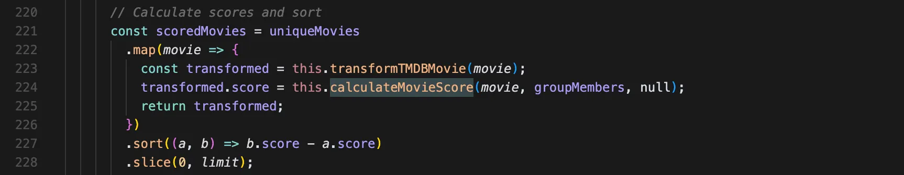
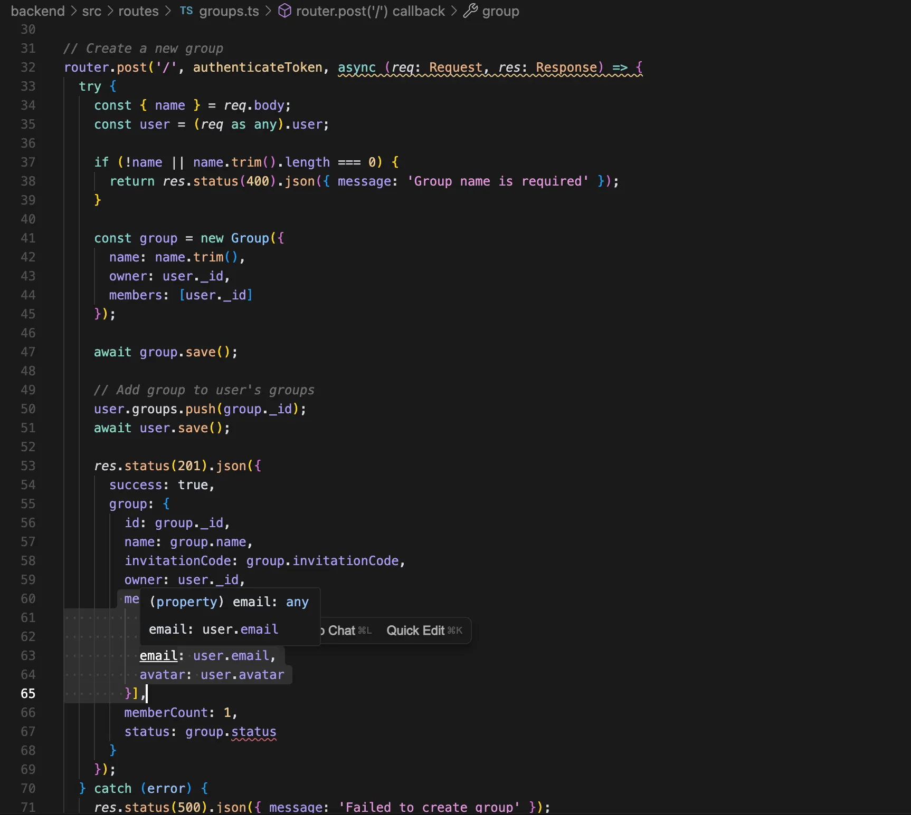
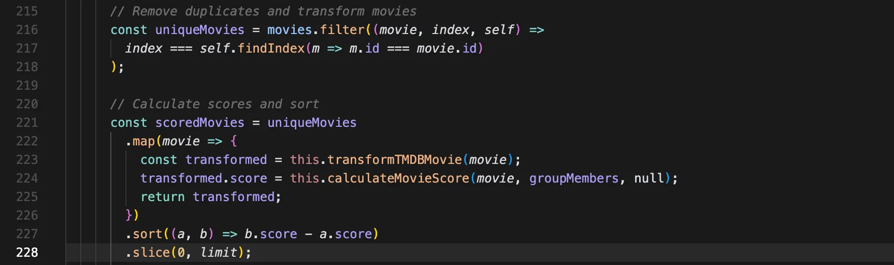

### Scenario 1: Observational Notes
This scenario evaluates the code generation when both frontend and backend are generated together in a single prompt. The observations highlight issues related to code structure (architecture), completeness, unnecessary code, security, and quality.

---
### Generation
Most of the time is spent on the backend and the frontend code is incomplete, frontend contains partially implemented code and includes references that the model did not generate.

For backend: It is nearly complete but the structure is not good, controllers and routes are not separated, the only parts that is mostly missing is about live updates. It took me a some time to make backend buildable and runnable. The MongoDB server that was set up doesn’t work because, during generation, it didn’t ask me for the server URI. As a result, it now tries to connect to something that doesn’t exist. 

For frontend: None of the backend apis are used (they are defined using retrofit but never used) there are only views. Code is just some views definition without any logic and it has a lot of build issues. Fixing one error would introduce many more.

### Run & Build
Backend runs but doesn't build.
ESLint not configured correctly.
Frontend project doesn't sync and run.
Dependencies: Glide is deprecated (not important, minor)

### Bugs
[Major] Shows start and end session button to every member in the group.

[Minor] Should only notify owner that a user has joined a group, not all the group members.

 

[Minor] It should not broadcast votings of a member to other members of the group.

 

[Minor] It should not broadcast to all if someone left the voting session.

 

[Minor] Should return error if you pass a non-member to be removed from the group.

 

[Minor] Should remove this API or add sessionId when getting user’s group info. Or remove sessionId from the api params.

 

[Major] No error handling for when save group fails.

 

[Major] No validation for the groupId while creating session.

 

[Major] Does not check if user id is valid.

 

[Major] Does not check if API key doesn’t exist.

 

Missing some parts of the third-party authentication configuration.

### Security
**Security vulnerability** Multer package with the version in the link below is in the dependencies:

https://security.snyk.io/package/npm/multer/1.4.5-lts.1

### Logical Issues
To get the user preferences, it has a property maxRating whereas it should be minRating. No user will say I don’t want the rate to be more than 7! → bug

It assumes that we have multiple session for each group.

### Hard-coded values
Uses a predefined list of genres. 

It is consistent with TMDB list for now but if TMDB updates it’s genre list then there will be inconsistencies.
It also get genres from TMDB in movie recommendation service.

 
 

Use magic numbers in code

 
 
 

Hardcoded states

 

### Naming Issues
It’s not clear what is decoded. -> `decodedUser`

 

It is not clear what is the difference between these two.

 

Not clear what progress is referring to. → `votingProgress` or `votingStatus`

 

This methods adds or updates vote.

 

### Unnecessary code
It’s not clear what userPreferences is and what use it has, also when calling this function the code passes null for this parameter!

 
 

No need for logout API since we use JWT.

 

No need for password-related functions since we use OAuth.

 
 

`MinYear`, `MaxYear`, and `MaxRating` is defined in user schema but never used.

Redundant info

 

Owner is a member of the group. No need to check for it separately.

 

### Boilerplate code
Used in socket.ts and 2 times in auth.ts.

 

In all routes instead of middleware.

 

In create, get, join group and get user’s groups.

 

Leave group and remove member from group could be one API. Or at least should move the duplicate code into a shared function.

 
 

`/profile` exists in both auth and user routes.

### Typing issues
Use of any. 15 found with search query of : any.

 

Incomplete typing

 

### Inconsistencies
`/profile`, `/verify`, and `/preferences` do not return the same user object.

 

Returning group owner’s info instead of group members can cause inconsistencies.

 

[ONLY AI] Wrong comment

 

### Design
The API logic should be handled in controllers.

 

Handle auth token in view model

 

### Efficiency
Can check first then create movies and avoid copying and pushing to array.

 
    

### Unused Code
Unused handler functions

 

Unused imports

 

Most of the defined APIs are not used.

Inconsistency between BE and FE API.

 
