### Scenario 4: Observational Notes
This scenario evaluates the code generation by-task with formal specifications. The observations highlight issues related to code structure (architecture), completeness, unnecessary code, security, and quality.

---
### Generation
The code is much less bloated now since we have specific prompts for each step, however, it still sometimes does not comply to the prompts and do exactly what it is asked for and tries to do more.

For backend: The code usually runs without any issue and needed no human intervention after each step. Sometimes there are TypeScript runtime errors that agent would fix, I just need to provide the error context. it generated 'Voting' domain schemas along with 'Movie' domain schemas which is weird considering that we asked it to ONLY implement the movie domain schemas. For generating create group, it also generated update and delete and I asked it why u generated more stuff and it said CRUD usually comes together so i was being pro-active.

For frontend: The issues require manual intervention, and often needs more rounds of attempts to have the issues fixed than backend. Generates the "Create New Group" button composable function but do not place the UI element on the correct screen. Again, it does not fully follow the instructions, when asked to implement the GroupList screen, it also implemented a part of the GroupList viewModel as well (It generated the ViewModel first).

### Run & Build
The backend builds and runs. The packages used as dependencies are okay:
https://snyk.io/advisor/check/npm/e463e766-2723-485a-ab3a-46bc0c1bdf78/sustainable

### Security
[MAJOR] No middleware for authentication, anyone can access different APIs

Logging user FCM tokens

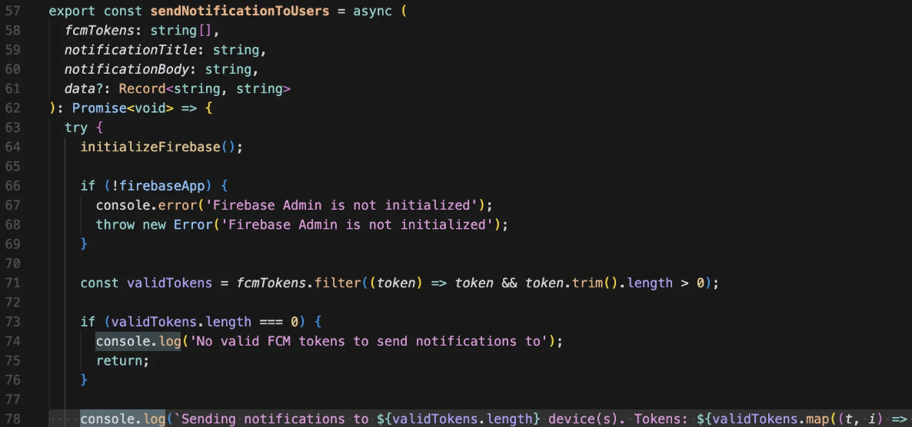 

### Bugs
Can create group with invalid genres, meaning if there are genrese selected that are not part of TMDB genres they would still work.

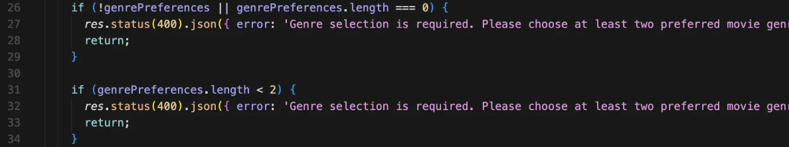 

### Typing Issues
Use of `any` to bypass correct typing and compiler catching typing issues. searching for `as any` in the code base returns 268 results.

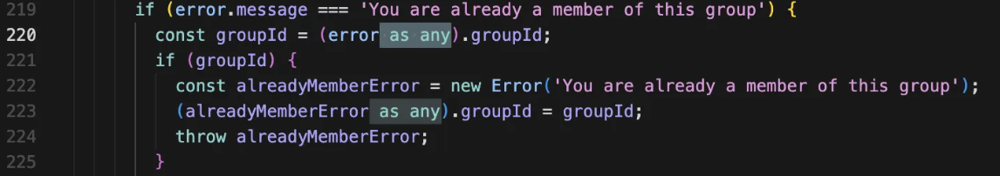 

There's also inline typing isnteadd of using shared types.

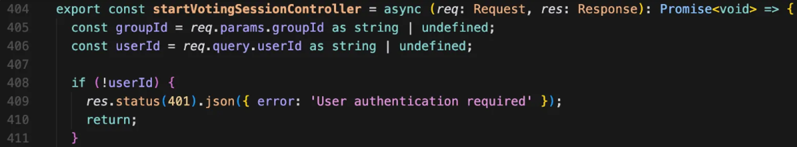 

### Unused Code
There are various unused imports that can be found throughout the code.

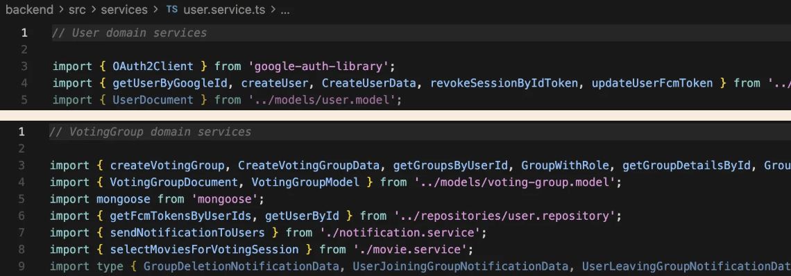 

### Hard-coded values
TMDB API is hardcoded in the code. 

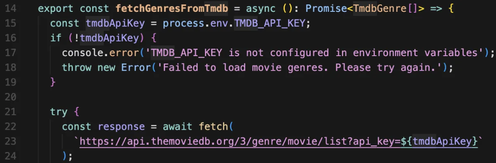 

There are also magic numbers in the code.

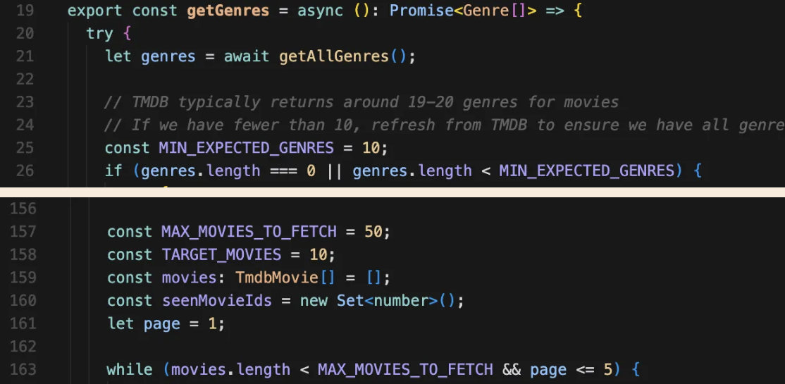 

### Unnecessary Code
code in the codebase that if removed wouldn't make any difference.

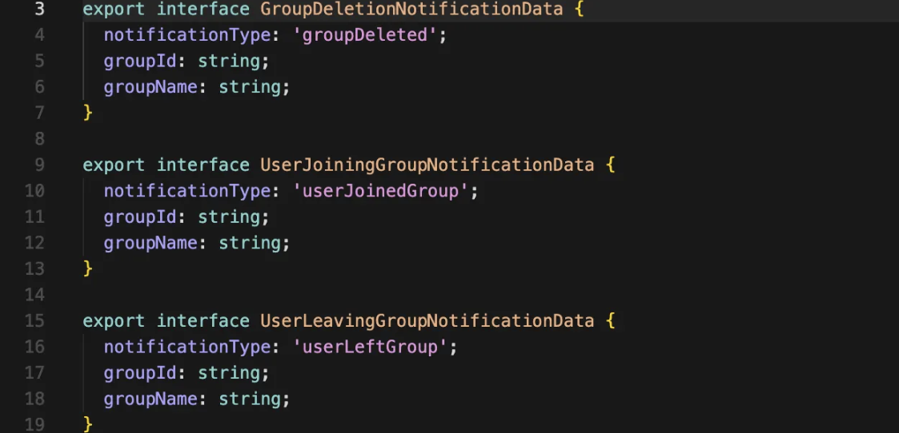 

### Design
Using utility functions in VotingGroup repository.

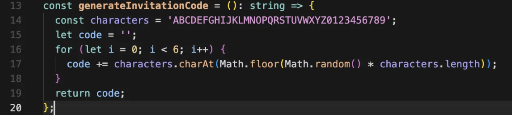 

### Duplicate code
Error handling for each API is repetetive.

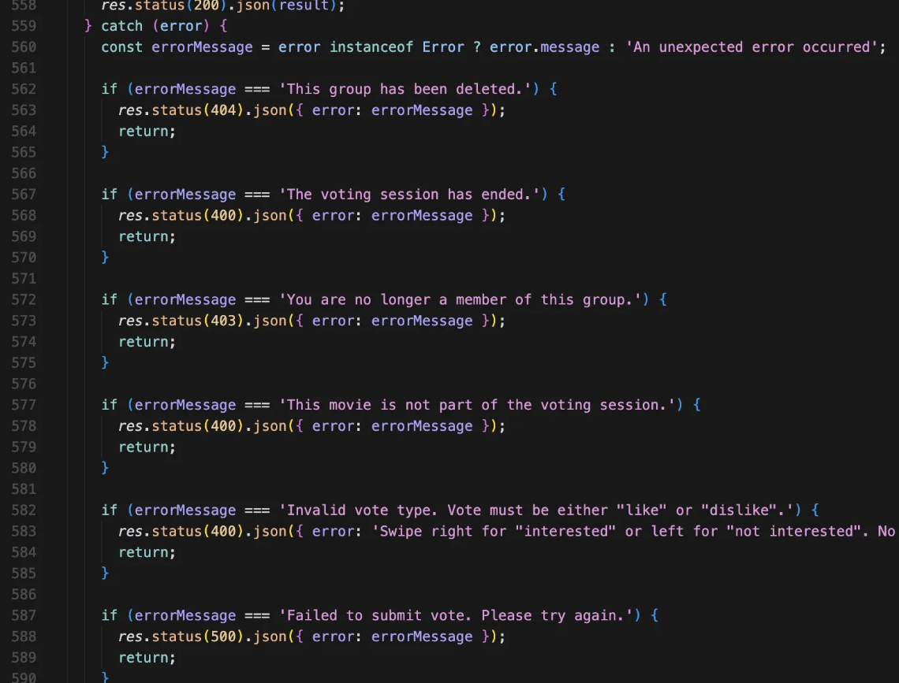 

### Efficiency
\+ There are some caching for the TMDB API

\- On every entry to voting screen the code loads genres whereas it is not needed!!

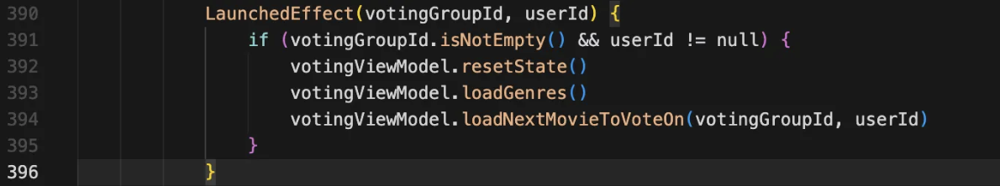 
