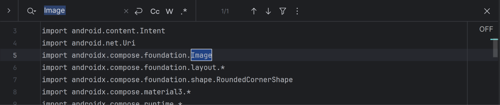

**Scenario 2: Observational Notes**

This scenario evaluates the code generation when frontend and backend are generated separately. The observations reveal improvements in architecture and structure, but also persistent and new issues in code quality, security, and maintainability.

---

**Code Generation Order**

Cursor implements both the frontend and the backend in a sequential buttom-up style.

Having the backend generated first and having it in the code base provides cursor with context before doing the frotend.

**Separation of Frontend & Backend**

\+ Looking at the generation flow. I see that separating the tech stack used by the model has a positive affect on the model. I remember reading a paper which suggested different model neurons get activated for different programming languages, therefore not switching between these nuerons seems to have a positive effect.

\- The separation of FE/BE while mostly benificial came with some challenges. For instance, integeration is now a new concern for the model which should be handled when generating the frontend using the provided docs by the backend generation. While this adds complexity I don't see it be worse than scenario 1, mainly because scenario 1 didn't do a really bad job at integration.

---


**Better Backend Architecture**

The backend shows improved structure with a proper controller layer—routes now only handle routing:

```
├───config
├───controllers*
├───docs
├───middlewares
├───models
├───routes
├───services
├───types
└───utils
```

**Rate Limiting Middleware**

Implementing the backend alone allowed the model to consider additional concerns. For instance, rate limiting middleware was added:

```
export const apiLimiter = rateLimit({
  windowMs: env.RATE_LIMIT_WINDOW_MS, // 15 minutes
  max: env.RATE_LIMIT_MAX_REQUESTS, // limit each IP to 100 requests per windowMs
  message: {
    success: false,
    error: 'Too many requests from this IP, please try again later.',
    retryAfter: Math.ceil(env.RATE_LIMIT_WINDOW_MS / 1000)
  },
  standardHeaders: true, // Return rate limit info in the `RateLimit-*` headers
  legacyHeaders: false, // Disable the `X-RateLimit-*` headers
  handler: (req, res) => {
    logger.warn(`Rate limit exceeded for IP: ${req.ip}`);
    res.status(429).json({
      success: false,
      error: 'Too many requests from this IP, please try again later.',
      retryAfter: Math.ceil(env.RATE_LIMIT_WINDOW_MS / 1000)
    });
  }
});
```

**Improved Environment Variable Handling**

Environment variables are handled much better with a dedicated configuration file instead of being handled inline where needed:

```
export interface EnvironmentConfig {
  // Server Configuration
  PORT: number;
  NODE_ENV: string;
  API_VERSION: string;
  
  // Database Configuration
  MONGODB_URI: string;
  
  // Authentication Configuration
  JWT_SECRET: string;
  JWT_EXPIRES_IN: string;
  GOOGLE_CLIENT_ID: string;
  GOOGLE_CLIENT_SECRET: string;
  FACEBOOK_APP_ID: string;
  FACEBOOK_APP_SECRET: string;
  
  // External APIs
  TMDB_API_KEY: string;
  TMDB_BASE_URL: string;
  
  // CORS Configuration
  ALLOWED_ORIGINS: string[];
  
  // Rate Limiting
  RATE_LIMIT_WINDOW_MS: number;
  RATE_LIMIT_MAX_REQUESTS: number;
  
  // WebSocket Configuration
  WEBSOCKET_CORS_ORIGINS: string[];
  
  // Logging
  LOG_LEVEL: string;
  
  // Security
  BCRYPT_SALT_ROUNDS: number;
  
  // Session Configuration
  SESSION_TIMEOUT_MS: number;
  INVITATION_CODE_LENGTH: number;
}
```

**Additional Functionality**

There are also new routes that might not be essential but demonstrate the model's freedom to explore more functionality when frontend and backend are prompted separately:

```
 // Check if user can start voting session
  public static canStartVoting = asyncHandler(async (req: Request, res: Response) => {
    const user = req.user!;
    const { groupId } = req.params;

    if (!groupId) {
      throw new ValidationError('Group ID is required');
    }

    const canStart = await groupService.canStartVoting(groupId, user._id.toString());

    const response: ApiResponse = {
      success: true,
      data: { canStartVoting: canStart },
      message: canStart ? 'Can start voting session' : 'Cannot start voting session - not all members have set preferences'
    };

    res.json(response);
  });
```

---

**Backend Issues**

Despite some advancements there are new issues as well as some issues already seen in scenario 1.

**Unused Imports**

There are some unused imports; for example, the logger and some error classes are imported but never used.

<br>

**Security Vulnerabilities in Dependencies**

Despite architectural improvements, new issues emerged:

```
85 packages are looking for funding
  run `npm fund` for details

2 vulnerabilities (1 moderate, 1 high)
```

**Build Errors**

The code is still not runnable due to TypeScript errors:

```
234       const vote = session.getUserVoteForMovie(userId, movieId);
                               ~~~~~~~~~~~~~~~~~~~


Found 27 errors in 6 files.

Errors  Files
     3  src/middlewares/auth.ts:87
     7  src/models/Group.ts:58
     2  src/models/User.ts:44
     7  src/models/VotingSession.ts:137
     5  src/services/GroupService.ts:116
     3  src/services/VotingService.ts:130
```

**REST Convention Misuse**

Using POST instead of DELETE for leave operations:

```
// Group membership
router.post('/:groupId/preferences', GroupController.setPreferences);
router.delete('/:groupId/members', GroupController.removeMember);
router.post('/:groupId/leave', GroupController.leaveGroup);
```

**Deprecated Code**

Using deprecated `substr` instead of `substring`:

```
export function generateSessionId(): string {
  return 'session_' + Math.random().toString(36).substr(2, 16) + '_' + Date.now().toString(36);
}
```

**Incomplete/Placeholder Code**

Code written for future use with no actual implementation:

```
// Admin middleware (for future use)
export function requireAdmin(req: Request, res: Response, next: NextFunction): void {
  if (!req.user) {
    return res.status(401).json({
      success: false,
      error: 'Unauthorized: Authentication required'
    });
  }
  
  // For now, all authenticated users are considered admins
  // In a real app, you'd check user roles here
  next();
}
```

**Persistent Security Issues**

JWT fallback values remain a security concern:

```
JWT_SECRET: process.env.JWT_SECRET || 'your-super-secret-jwt-key-change-in-production',
JWT_EXPIRES_IN: process.env.JWT_EXPIRES_IN || '7d',
```

**Input Validation Issues**

Input validations are not centralized using deserializers; instead, each controller performs ad-hoc validation:

```
if (!groupData.name || groupData.name.trim().length === 0) {
      throw new ValidationError('Group name is required');
    }
```

**Missing Caching**

There's no caching for external API calls, which is a performance issue.

---


**More Complete Implementation of Frontend**

The frontend is performing much better than what was observed in Scenario 1. There are more files generated and functionalities are more complete.

**User Data Persistence**

For instance, there's a class to save user's data and token:

```
@Singleton
class UserPreferencesDataStore @Inject constructor(
    @ApplicationContext private val context: Context
) {
    private object PreferencesKeys {
        val AUTH_TOKEN = stringPreferencesKey("auth_token")
        val USER_ID = stringPreferencesKey("user_id")
        val USER_NAME = stringPreferencesKey("user_name")
        val USER_EMAIL = stringPreferencesKey("user_email")
        val PROFILE_PICTURE_URL = stringPreferencesKey("profile_picture_url")
    }
```

*Note: The code adds functionality but is insecure as it doesn't encrypt the saved token (EncryptedSharedPreferences should be used instead).*

**Improved Architecture**

There's a new repository layer over the datasources (similar improvement as what the backend received). This demonstrates that separating concerns allows the model to think more about non-functional aspects like code structure and architectural design. ViewModels are now present to handle state management.

---

**Frontend Issues**

**Degraded File Organization**

Despite some improvements, some other things got worse. In Scenario 1, there was a by-feature separation in the Screens folder which is now lost. Screen files are laid flat, which is less maintainable:

**Scenario 1 (better):**
```
Screens
│      auth
│      groups
│      home
│      voting
```

**Scenario 2 (worse):**
```
Screens:
│       CreateGroupScreen.kt
│       GenreSelectionScreen.kt
│       GroupDetailsScreen.kt
│       GroupListScreen.kt
│       HomeScreen.kt
│       JoinGroupScreen.kt
│       LoginScreen.kt
│       MovieResultScreen.kt
│       VotingScreen.kt
```

**Build Failures**

The frontend code does not build successfully due to multiple configuration issues (dependency issues) and unresolved references.

**Deprecated Icons**

Using deprecated icons:

```
import androidx.compose.material.icons.filled.ArrowBack
```

**Magic Numbers**

Magic numbers used throughout the code:

```
if (abs(offsetX) > 50f) {  // Magic number
                SwipeIndicator(
                    isLike = offsetX > 0,
                    alpha = (abs(offsetX) / 200f).coerceAtMost(1f)
                )
            }
```

```
               translationX = offsetX,
                translationY = offsetY,
                rotationZ = offsetX / 20f
```

**Incomplete Error Handling**

Error handling is incomplete with placeholder comments:

```
            // Error handling
            uiState.error?.let { error ->
                LaunchedEffect(error) {
                    // Show error (could use SnackbarHost in a real app)
                }
            }
```

**Unused Imports**

<br>

**Repeated Error Handling Pattern**

Same error handling pattern copied throughout the codebase (The error handling is also generic):

```
suspend fun getUserGroups(): Resource<List<Group>> {
        return try {
            val response = apiService.getUserGroups()
            if (response.isSuccessful && response.body()?.success == true) {
                val groups = response.body()?.data ?: emptyList()
                Resource.Success(groups)
            } else {
                Resource.Error(response.body()?.message ?: "Failed to get groups")
            }
        } catch (e: Exception) {
            Resource.Error(e.message ?: "Network error")
        }
    }

    suspend fun createGroup(name: String, description: String? = null): Resource<Group> {
        return try {
            val request = CreateGroupRequest(name, description)
            val response = apiService.createGroup(request)
            if (response.isSuccessful && response.body()?.success == true) {
                val group = response.body()?.data
                if (group != null) {
                    Resource.Success(group)
                } else {
                    Resource.Error("Group data is null")
                }
            } else {
                Resource.Error(response.body()?.message ?: "Failed to create group")
            }
        } catch (e: Exception) {
            Resource.Error(e.message ?: "Network error")
        }
    }

    suspend fun joinGroup(invitationCode: String): Resource<Group> {
        return try {
            val request = JoinGroupRequest(invitationCode)
            val response = apiService.joinGroup(request)
            if (response.isSuccessful && response.body()?.success == true) {
                val group = response.body()?.data
                if (group != null) {
                    Resource.Success(group)
                } else {
                    Resource.Error("Group data is null")
                }
            } else {
                Resource.Error(response.body()?.message ?: "Failed to join group")
            }
        } catch (e: Exception) {
            Resource.Error(e.message ?: "Network error")
        }
    }

    suspend fun getGroupDetails(groupId: String): Resource<Group> {
        return try {
            val response = apiService.getGroupDetails(groupId)
            if (response.isSuccessful && response.body()?.success == true) {
                val group = response.body()?.data
                if (group != null) {
                    Resource.Success(group)
                } else {
                    Resource.Error("Group data is null")
                }
            } else {
                Resource.Error(response.body()?.message ?: "Failed to get group details")
            }
        } catch (e: Exception) {
            Resource.Error(e.message ?: "Network error")
        }
    }
```

**Hardcoded URLs**

```
    @Provides
    @Singleton
    fun provideRetrofit(
        okHttpClient: OkHttpClient,
        moshi: Moshi
    ): Retrofit {
        return Retrofit.Builder()
            .baseUrl("http://localhost:3000/api/v1/") // Development server
            .client(okHttpClient)
            .addConverterFactory(MoshiConverterFactory.create(moshi))
            .build()
    }
```

---


**Integration: Enum Mismatch Between Frontend and Backend**

Incorrect implementations causing integration issues. The enum for voting status in the backend:

```
export enum VotingStatus {
  WAITING = "waiting",
  ACTIVE = "active",
  COMPLETED = "completed",
  CANCELLED = "cancelled"
}
```

But the frontend uses:

```
enum class VotingStatus {
    @Json(name = "active") ACTIVE,
    @Json(name = "ended") ENDED  // Should be "completed"!
}
```

This represents a significant integration and consistency issue.

---


**Authorization Check**

Something better than Scenario 1: there's now a check to show the start voting button only to the group owner.

---

**Personal Take**

There are more things that make sense with the generation now. Separating frontend and backend is the way to go in many settings either it be a group project or a big tech company. Splitting work by technical stack allows developers (and as it seems AI agents) to focus more deeply on their task. The model can have more context for each prompt and therefore it can genearte more code. 

That said the code is still hardly understandable and difficult to run/build/fix. Separation helps the model focus, but doesn't eliminate the need for careful human review and A LOT OF manual fixes. I would still rather just throw this code away and start coding myself. 
